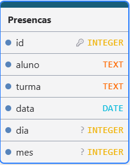

# Sistema de Registro/Consulta de Presença

Sistema para registro de presença dos alunos dos cursos da Fábrica de Programadores.

---

## 📌 Funcionalidades

- Registro de presenças
- Consulta de presenças por turma
- Consulta de presenças por aluno
- Banco de dados PostgreSQL hospedado no Supabase

---

## 🛠️ Tecnologias Utilizadas

- Python
- Streamlit
- PostgreSQL (Supabase)
- Pandas

---

## 📂 Estrutura do Projeto

```bash
📦 Sistema-presenca
├── dados/
├── app.py
├── banco_alunos.py
├── requirements.txt
├── .env
└── README.md
```

---

## ⚙️ Instalação

### 1. Clone o repositório

```bash
git clone https://github.com/TJfiles/Sistema-de-registro-de-presen-as-F-brica-de-Programadores.git
```

### 2. Instale as dependências

```bash
pip install -r requirements.txt
```
### 3. Crie um arquivo .env com:
```bash
SUPABASE_URL=[SEU-COMMIT-LINK-DO-SUPABASE]
SUPABASE_KEY=[SUA-CHAVE-DO-SUPABASE]
```
### 4. Crie uma tabela chamada Presenca no Supabase conforme a imagem


### 5. Liste todos os seus alunos e turmas em um arquivo .csv conforme o exemplo
```bash
id,turma,nome_aluno
1,Terça e Quarta - Manhã, Aluno Teste
```

---

## ▶️ Como Executar

### Streamlit
```bash
streamlit run app.py
```


